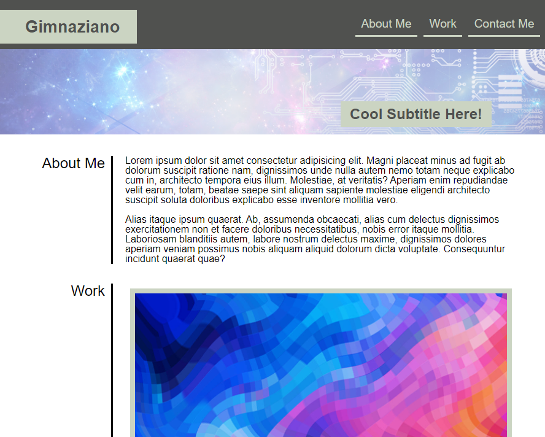
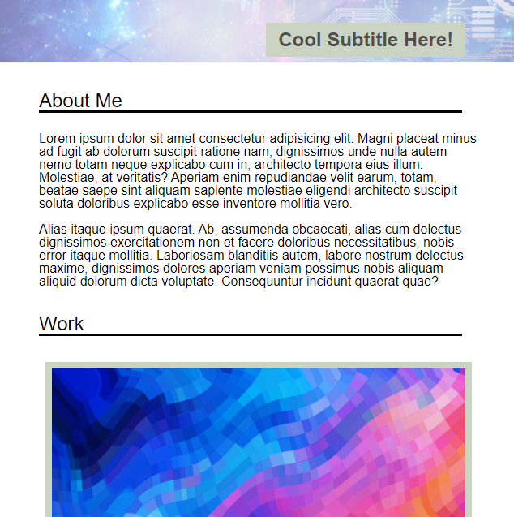

# 2: Responsive Portfolio
Due Date: 2/3/2021 @ 11:59 PM

Coding Bootcamp Homework Assignment #2
# 02 Advanced CSS: Portfolio
The primary objectives of this exercise were to demonstrat the use of the following:

* flexbox
* media queries
* CSS variables
* testing signed commits

# References / resources 

* https://pngtree.com/free-backgrounds
* https://dummyimage.com/
* https://coolors.co/

## Screenshots
* Fullscreen

* With Media Query active for smaller devices

## Links
* This repo is located [on github](https://github.com/jonesjsc/2-Responsive-Portfolio)
* This site is deployed on [github pages](https://jonesjsc.github.io/2-Responsive-Portfolio/)